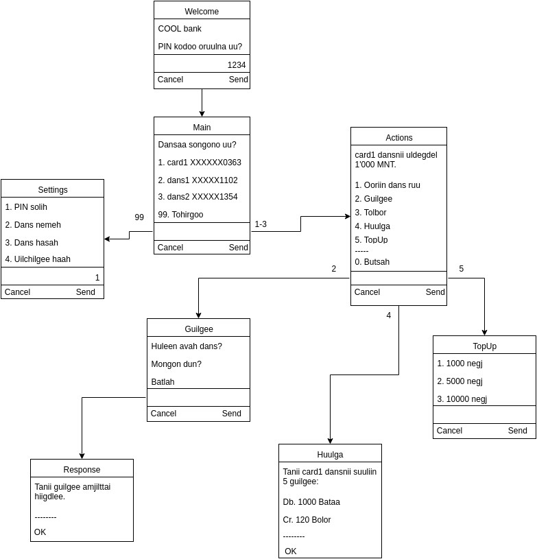

# Mobile Banking

Банкууд, мобайл операторууд хамтран төрөл бүрийн Мобайл банкны шийдэл нэвтрүүлсэн байдаг. Тухайлан нэрлэвэл SIM Toolkit Mobile Bank, Smart утасны Mobile Bank, SMS bank зэрэг шийдлүүд бий.

Эдгээр шийдлүүд нь тус бүрдээ давуу болон сул талуудтай. Тухайлбал SIM Toolkit Мобайл банкны хувьд SIM дээр цэс суулгадаг, энэ цэс нь заримдаа устаж алга болдог, дахин суулгахад хүндрэлтэй байдаг. Smart утасны Мобайл банкны хувьд 3G, GPRS эсвэл WiFi шаардлагатай болдог.

Тийм учраас USSD технологи ашиглан гар утаснаас дуудлага хийх (dial) замаар хэрэглэж болох хялбар, авсаархан, хурдан, нууцлал сайтай мобайл банкны үйлчилгээ нэвтрүүлэх шаардлагатай байгаа юм.

## USSD гэж юу вэ?

Unstructured Supplementary Service Data буюу USSD нь гар утас болон сервер програмын хооронд холболт тогтоож (session) түүгээрээ текстэн мэдээлэл солилцох харилцаа холбооны технологи юм.

## USSD Мобайл банкны давуу тал

USSD технологи дээр суурилсан Мобайль банкны үйлчилгээ нь олон давуу талтай.

* Хэрэглэхэд маш хялбар. Тусгай формат, команд, дугаар цээжлэх шаардлагагүй. Өөрийн дэвтэртээ (contact book) USSD дугаарыг (*1515# г.м) хадгалаад тэндээсээ шууд сонгож банкны цэсийг дуудна.

* Хямд: 3G, GRPS, Интернэт шаардахгүй, ө.х дата багц ашиглах идэвхжүүлэх шаардлагагүй. Энэ нь хэрэглэгчдийн хувьд маш таатай байх болно. Ердийн дуудлага хийх замаар мэдээлэл солилцох бөгөөд үнийн хувьд мессежийн үнэтэй адил байх боломжтой. 

* Хаана ч ажиллана: Гар утасны 2G сүлжээ орсон ямар ч газар ажиллана. Тухайлбал хөдөө орон нутаг, аялал зам зуур г.м ашиглах бүрэн боломжтой.

* Цэс нь динамикаар сервер талд зурагдах учраас мобайл оператораас хамааралгүй нэмэлт хөгжүүлэлт хийх бүрэн боломжтой. SIM Toolkit ашигласан шийдэл нь ийм боломжгүй байдаг.

* Нууцлалын хувьд бусад Мобайл банкны шийдлүүдээс илүү. Тухайлбал SMS banking шийдэлд мэдээллийг текстэн хэлбэрээр ил задгай солилцдог бөгөөд мэдээлэл нь SMS сервер болон сүлжээний олон төхөөрөмж дээрээс задрах боломжтой байдаг. USSD технологийн хувьд радио суваг ашигладаг учраас дуудлагын нууцлалтай ижил түвшинд байдаг.

# Хавсралт.A: Жишээ цэс

USSD Мобайл банкны жишээ цэсний бүтцийг дараах зурагт харуулав. 

## Үндсэн цэс/дараалал

Дэлгэцийн тайлбар:

* Үндсэн дэлгэцэнд данснуудын сонголт харагдана, мөн тохируулга хийх цэс байна.
* Гүйлгээг өөрийн данс хооронд болон бусад гүйлгээ гэж хуваасан. Бусад гэдэгт банк хоорондын гүйлгээг оруулж ойлгоно. Гадаад гүйлгээ хийхгүй.
* Дансны дэвтэр гэсэн ойлголтыг оруулах нь зүйтэй. Байнга гүйлгээ хийдэг дансуудаа бүртгэх замаар хялбар, хурдан гүйлгээ хийх боломжтой болно. Мөн энэ цэснээсээ гүйлгээ хийх, данс нэмэх, хасах боломжтой байна.
* Төлбөр төлөх цэс заавал байх хэрэгтэй. Тухайн хэрэглэгчид хамаатай нэхэмжлэлүүдийг татаж харуулж болно. Эсвэл нэхэмжлэлийн кодоо мэдэж байгаа бол шууд оруулаад төлж болно.
* TopUp цэсээр гар утасны нэгж худалдан авч болно.

## Шинэ харилцагчийг бүртгэх дараалал

